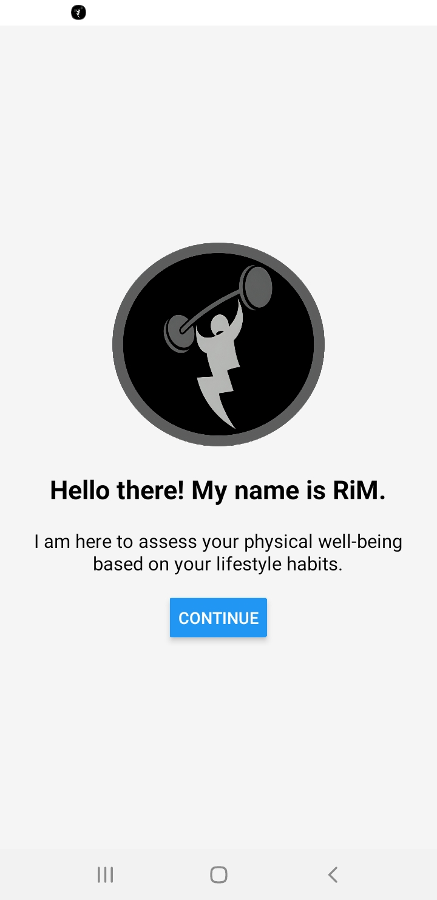
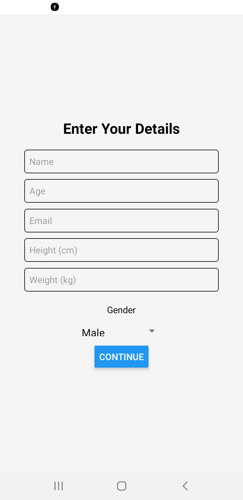
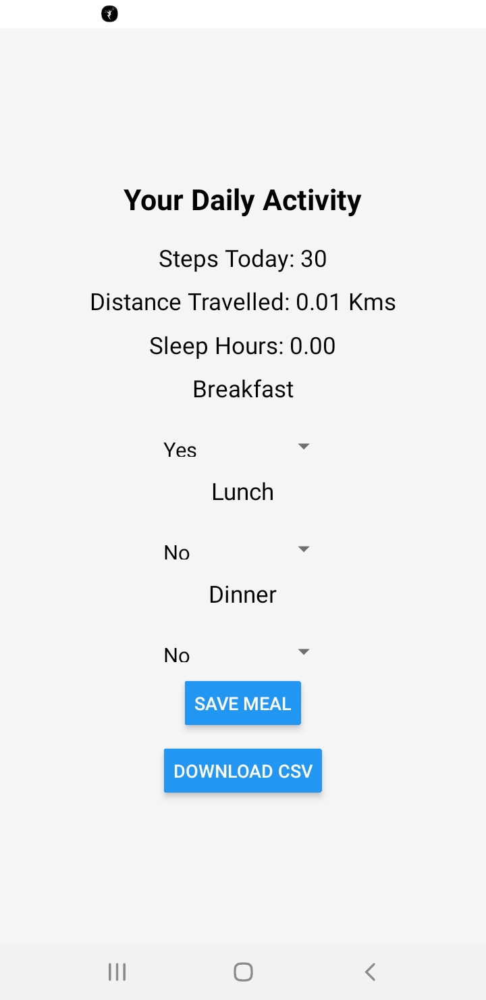
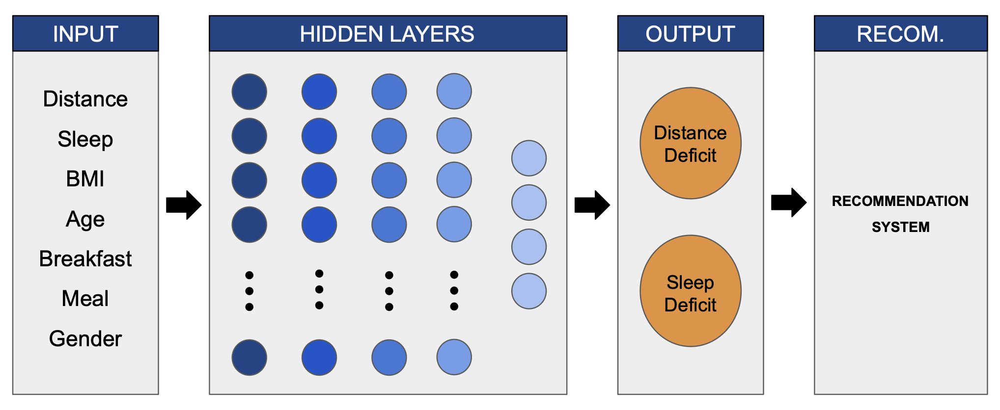

# RiM: Record, Improve and Maintain Physical Well-being using Federated Learning

This repository contains the code and thesis for the BS project undertaken in the fall semester at IISER Bhopal under the supversion of Prof. Haroon Lone.

## Mobile Application
The folder contains the script for the developed mobile application along with its apk. The zip file contains the entire script and dependencies in order to reproduce and develop the mobile application. The application have been developed using React and Expo. 

The screenhot of the application is given below:

         


## Federated Learning
The folder contains the python script for server and client devices. It also includes the developed pre-trained MLP model. 

- To run the FL model use the following command and run for each client simultaneously:

```bash
python server.py
python client.py --client_id [enter id here]
```

The structure of the develop MLP model is depicted in the following figure:




